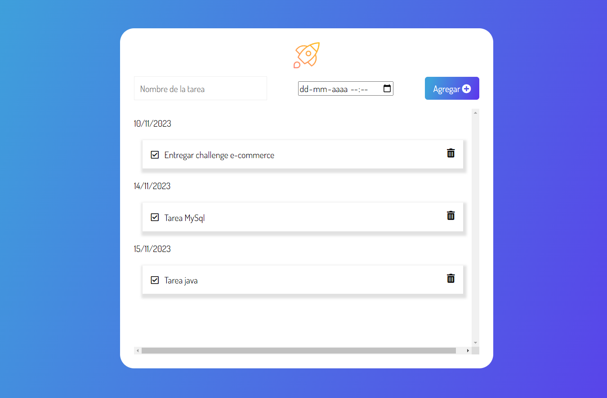
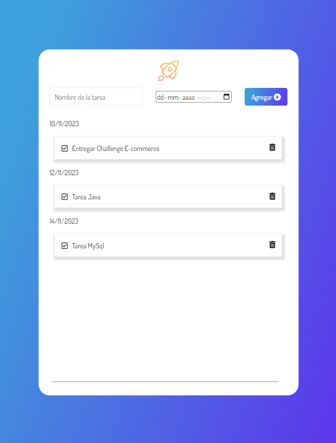
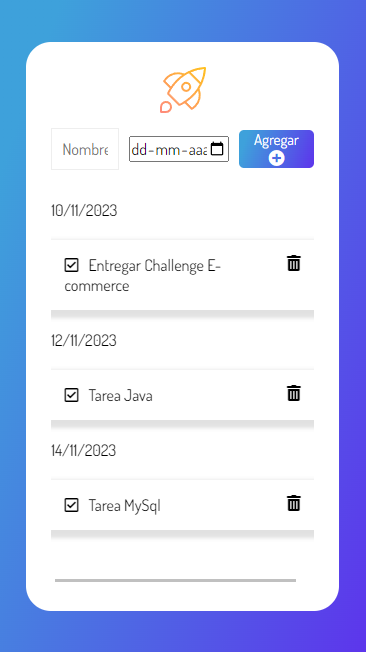

# Sitio para organizar tus tareas

## Índice

* [1. Descripción del Proyecto](#1-descripcion-del-proyecto)
* [2. Características](#2-caracteristicas)
* [3. Instrucciones de uso](#3-instrucciones-de-uso)
* [4. Contribuciones](#4-contribuciones)
* [5. Contacto ](#5-contacto)

## 1. Descripción del Proyecto
Este proyecto comenzó el año 2022 cuando me encontraba en el programa de Oracle. Muchos compañeros tenían problemas en la organización de tareas y poder cumplir con las fechas establecidas. Es por ello, que creé este proyecto de planificación de tareas en noviembre de dicho año, pero al verlo este año decidí darle más funcionalidad y responsive con el objetivo de que ahora sea una aplicación más funcional. A continuación podrás ver la aplicación en distintos sizes. 

### Desktop Size

### Tablet Size

### Mobile Size

## 2. Características

Las características funcionalidades de este proyecto son los siguientes:

* Crear tarea: Agregar una tarea proporcionando su nombre y fecha. Opcional agregar hora en caso de que sea necesario.

* Eliminar Tarea: Eliminar una tarea de la lista al hacer click en el icono de basura.

* Checklist: Mostrar que una tarea ya se encuentra completada al hacer click en el icono de check. 

* Fecha: Puedes personalizar la fecha de cada tarea, donde cada una se ordenará en formato más urgente de entrega a la más holgada.

## 3. Instrucciones de uso

1. Clona este repositorio.
2. Abre una terminal y navega hasta el directorio del proyecto.
3. Ejecuta npm install para instalar las dependencias.
4. Ejecuta npm start para iniciar la aplicación en tu navegador.
5. Interactúa con la aplicación para organizar tus tareas. 

## 4. Contribuciones
¡Las contribuciones son bienvenidas! Si deseas contribuir a este proyecto, sigue estos pasos:

1. Realiza un fork de este repositorio.
2. Crea una rama con una descripción clara de la función que estás implementando.
3. Desarrolla y prueba tu función.
4. Realiza un pull request describiendo tus cambios.

Como tip: Se pueden agregar funcionalidad de editar la tarea. 

## 5. Contacto
- [x] Si tienes alguna pregunta o sugerencia, no dudes en ponerte en contacto conmigo! [Aquí](https://www.linkedin.com/in/mariaignaciasilva/)

¡Que disfrutes utilizando esta aplicación para administrar tareas!